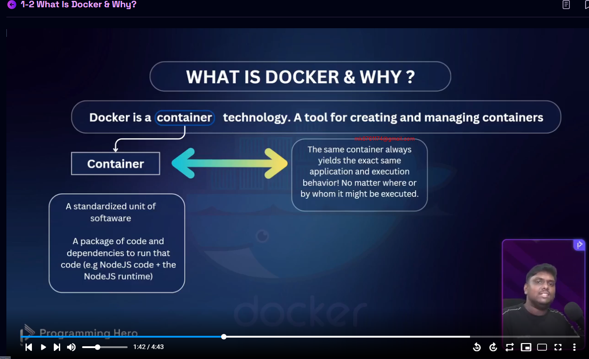
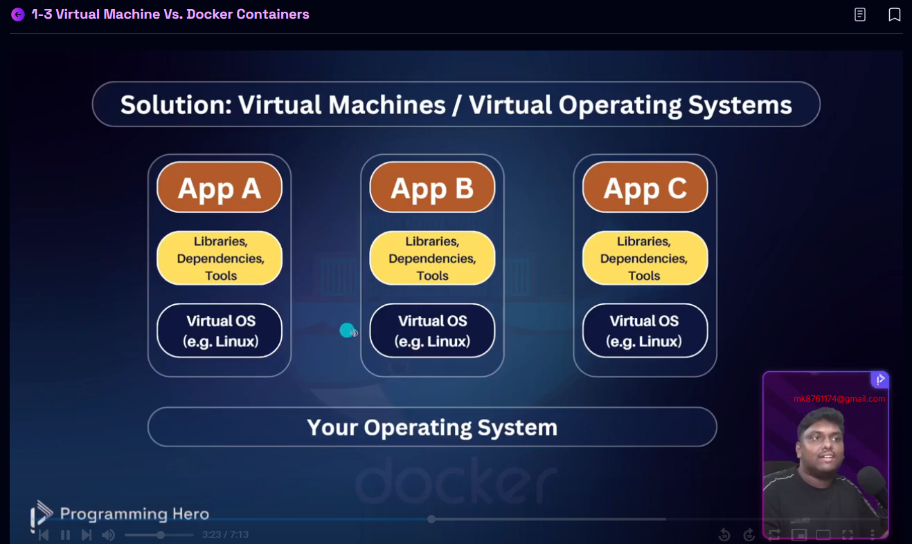
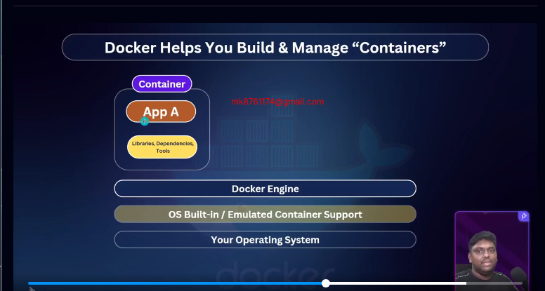
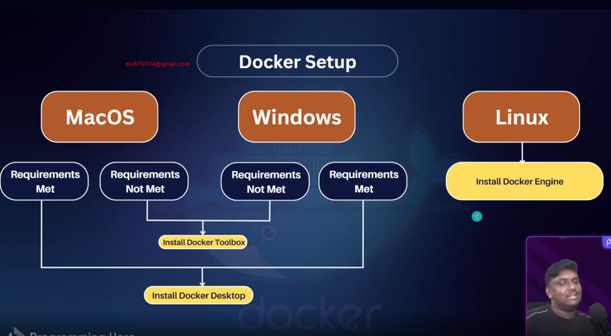
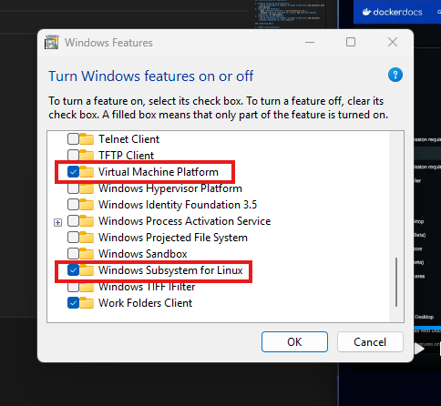
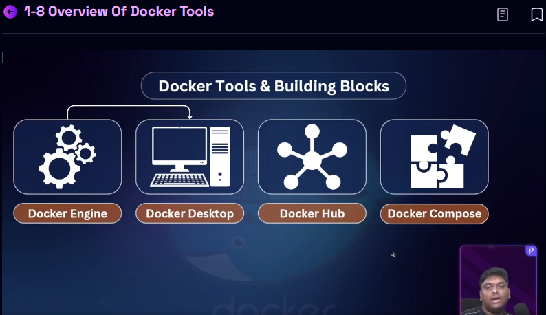

তুমি যদি Docker জানো, তুমি হিরো!"


ইয়া হু হু হু ! তুমি কি প্রস্তুত? তোমরা যারা কোডিং করো, তাদের জন্য একটা গোপন অস্ত্র আছে, আর সেটা হলো Docker! তুমি কি জানো, কেন এটা এত জনপ্রিয়? কারণ এটা এমন এক “কনটেইনার ম্যাজিক”, যেটা দিয়ে তুমি তোমার কোডকে এমনভাবে প্যাক করতে পারবে যে পৃথিবীর যেকোনো pc তে রান করতে পারবা!


কেন Docker তোমার জন্য ভীষণ দরকার?


Docker বললে কি মনে আসে? আমার মনে আসে সেই ছোটবেলার বিখ্যাত ব্যাকপ্যাক! তুমি যা কিছু চাও সব এক্সট্রা, সবকিছু ঠেসে ঢুকিয়ে নাও, তারপর দৌড়ে বেরিয়ে পড়ো। Dockerও ঠিক তাই! তুমি অ্যাপ্লিকেশন প্যাক করবে, সবকিছু পুটুস পুটুস ঢুকাবে, তারপর যেকোনো জায়গায় নিয়ে গিয়ে তা সহজেই চালাতে পারবে। আর এটাই হলো Docker এর ম্যাজিক! তুমি একবার শিখলে, সারাজীবন স্কিল পয়েন্ট বয়ে বেড়াবে। মাথার মধ্যে সবসময় বাজবে, "ঐ মামা! তুমি Docker কেনো ইউজ করো না?"


এই মডিউলে তোমরা যা শিখবেঃ


## ১-১ Get Started With Docker

- তুমি যদি কখনো ভেবেছো Docker কীভাবে কাজ করে, তাহলে এই ভিডিও তোমার জন্য। একদম শুরু থেকে শুরু করবো। চোখ খুলে রাখো, কারণ মজার কিছু জিনিস দেখার জন্য প্রস্তুত হয়ে যাও! 


## ১-২ What is Docker & Why?

- Docker কি? কেন এটা নিয়ে সবাই এমন হাইপে থাকে? কারণ এটা তোমার কোডিং লাইফকে করবে সুপার ফাস্ট, সুপার স্মুথ! একেবারে ম্যাজিক!


## ১-৩ Virtual Machine vs Docker Containers
- এইটা বুঝার পর তুমি বলে দিবে—VM তো পুরাতন খবর মামা! Docker হলো আসল হিরো, কন্টেইনারের ফ্লেক্সিবলিটি পেয়ে তুমি আর পিছে ফিরে তাকাবে না।

## ১-৪ Docker Setup

- তো, কিভাবে সেটআপ করবে এই জাদুকরী টুল? এটা একদম সহজ! একবার সেটআপ হয়ে গেলে, তোমার মেশিন হয়ে যাবে একদম Docker-prepared! 🚀


## ১-৫ Docker Installation [Windows]
- Windows ইউজাররা! তোমার জন্য আলাদা টিউটোরিয়াল, একদম হ্যান্ডস-অন! নিজের হাতে Docker সেটআপ করো, আর কোডিংয়ের মাঠে ঝাঁপিয়ে পড়ো।


## ১-৬ Docker Installation [Mac]
- Mac ইউজারদের জন্য? চিন্তা নাই মামা, Mac-এ ও Docker ইনস্টল করা একদম পানির মতো সহজ! 


## ১-৭ Docker Installation [Linux]

- Linux দুনিয়ার হ্যাকার ফ্রেন্ডরা! তোমাদের জন্যও পুরো ইনস্টল গাইডলাইন। একবার Linux-এ Docker সেটআপ করো, তারপর তো "এই পাখি উড়ে যাবে দূর"। 🐧


## ১-৮ Overview of Docker Tools
Docker তো শুধু একটা জিনিস না, সাথে থাকে আস্ত টুলবক্স! এসব টুলের সাথেও তোমার পরিচয় করিয়ে দিবো। পরে এগুলা চালিয়ে যাও মনের সুখে!


## ১-৯ Configuring VS Code & Creating The First Container

- এখন তোমার সেরা কোড এডিটর VS Code-এ Docker চালানো শিখবো। আর প্রথম কন্টেইনার বানানো? এটা একদম প্রথমবারের মত সাইকেল চালানোর মতো—একবার শিখে নিলে জীবনে ভুলবে না! 


- এই পুরো কোর্সে শুধু তোমার প্রজেক্ট নয়, তোমার আত্মবিশ্বাসও ডেভেলপ হবে! Docker হলো সেই টুল, যা তোমাকে তোমার ফিউচার জব মার্কেটে একটা লেভেল আপ দিবে।তোমার Docker জার্নি একদম শুরুর দিকে, কিন্তু এটা তোমাকে তোমার পরবর্তী ক্যারিয়ারের পথে আরও এগিয়ে নিয়ে যাবে। Let’s Dockerize your dreams! Keep pushing, keep learning, কারণ তুমি পারবে!


- GitHub Link: https://github.com/Apollo-Level2-Web-Dev/first-docker-container

- WSL Cheat Sheet: https://find-saminravi99.notion.site/WSL-Cheat-Sheet-10dc48b8ac8c800eb30ec02c8d0507d5?pvs=4

# WSL Cheat Sheet

### **Checking WSL Installation**

1. **List Installed Distributions**:
    
    ```bash
    wsl --list --all
    
    ```
    
2. **List Running Distributions**:
    
    ```bash
    wsl --list --running
    
    ```
    
3. **Check Available Online Distributions**:
    
    ```bash
    wsl --list --online
    
    ```
    
4. **Check WSL Version**:
    
    ```bash
    wsl --list --verbose
    
    ```
    
5. **Check if WSL Feature is Enabled**:
    
    ```bash
    dism.exe /Online /Get-Feature /All | find "Microsoft-Windows-Subsystem-Linux"
    
    ```
    

### **Installing a New Distribution**

1. **Install a Distribution**:
(Replace `<distro-name>` with the name of the distribution, e.g., `Ubuntu`.)
    
    ```bash
    wsl --install -d <distro-name>
    
    ```
    

### **Uninstalling a Distribution**

1. **Unregister (Uninstall) a Distribution**:
    
    ```bash
    wsl --unregister <distro-name>
    
    ```
    
2. **Check for Remaining Files**:
    - Path: `C:\\Users\\<your-username>\\AppData\\Local\\Packages\\<distro-folder>\\LocalState\\`
    - Ensure no `.vhdx` files remain.

### **Uninstalling WSL Completely**

1. **Remove Installed Distributions**:
    - Go to **Settings** → **Apps** → **Apps & Features** and uninstall each distribution.
2. **Disable WSL Feature**:
    - Open **Windows Features** (`optionalfeatures.exe`).
    - Uncheck **Windows Subsystem for Linux** and **Virtual Machine Platform** (if applicable).
3. **Remove WSL Kernel Update**:
    - Go to **Settings** → **Apps** → **Apps & Features** and uninstall **Windows Subsystem for Linux Update**.

### **Starting WSL**

1. **Open a Distribution**:
    
    ```bash
    wsl -d <distro-name>
    
    ```
    
2. **Open from Start Menu**:
    - Search for the distribution (e.g., Debian, Ubuntu) in the Start Menu.

### **Logging Out of WSL**

1. **Logout Command**:
or
    
    ```bash
    exit
    
    ```
    
    ```bash
    logout
    
    ```
    

### **Terminating WSL**

1. **Terminate a Running Distribution**:
    
    ```bash
    wsl --terminate <distro-name>
    
    ```
    

### **Additional Tips**

- To update your WSL kernel manually, you can check [Microsoft's WSL documentation](https://docs.microsoft.com/en-us/windows/wsl/install) for the latest version.

---

# 1-1 Get Started With Docker
- Its all about making a complex application portable so that it can be run in any environment without any compatibility issues.

# 1-2 What is Docker & Why?
- Docker is a container technology. A Tool For Creating and Managing Container.

 ### What is Container? 
   - **Container is a Standardized Unit of software** : A Package of code and dependencies to run that code( eg. nodejs code  + nodejs runtime + tools  + environment) 
    #### Why Container? 
     - When we do a code contenization , The same container always yields the exact same application and execution behaviour! No matter where or by whome it might be executred. 

- If we have docker in my machine then we do not think about which version and dependencies are installed in my machine. Because docker container has its own dependencies and version.


# Be a cloud-Container-Craftsman

- for exam suppose you work node js 14 in any application a and after some month later you update node js version and then you open your before application while you run 14 version and somehow any code not work in 20 version this is a problem 
and docker this problem solved easily  any application any version run easily
- the power of docker anyone can run this environment any version its doesnt matter which version he used

## 1-3 Virtual Machine vs. Docker Containers


- when we used virtual machine every operationg system have own different virtual os and whose project we can run install all dependencies and tools example we install node 20 version if we share this project other person to anyway but problem is any virtual machine only run one project 
but we always not working just a one project we work may project but probelem is diffrent project set up again virtaula and more project same to same install and huge memory space he catched this is a big probelem  you ssd and harddisk is full

then this problem  solved  is docker doecker not installed any virtual project and operating 

Virtual Machine (VM) vs Docker Containers
1. Virtual Machine (VM)

A Virtual Machine is a fully virtualized computer that runs on a physical machine using a hypervisor.

Key points:

Each VM has its own operating system (Guest OS)

Requires more CPU, RAM, and storage

Slower startup time

Strong isolation between systems

Suitable for legacy applications and full OS environments

2. Docker Containers

A Docker Container is a lightweight environment that packages an application with its dependencies.

Key points:

Containers share the host OS kernel

Very lightweight and fast to start

Uses fewer system resources

Ideal for microservices and cloud-native applications

Easier to scale and deploy
| Feature          | Virtual Machine         | Docker Container      |
| ---------------- | ----------------------- | --------------------- |
| Operating System | Separate OS for each VM | Shares host OS        |
| Size             | Large (GBs)             | Small (MBs)           |
| Startup Time     | Slow                    | Very fast             |
| Resource Usage   | High                    | Low                   |
| Isolation        | Strong                  | Moderate              |
| Best Use Case    | Legacy apps, full OS    | Microservices, DevOps |

One-line  Answer:

Virtual Machines run full operating systems with high resource overhead, while Docker containers share the host OS kernel, making them faster, lightweight, and better suited for modern application development.

## 1-4 Docker Setup

## 1-5 Docker Installation [Windows]
- search feature in your windows and turn on this feature

- docker install command 
```bash
wsl --install -d Devian
```
- then set a suer name and and password then you loggin
- logout command exit 
- docker --help check all commands

## 1-8 Overview of Docker Tools

- dockar engine (linux by default got it) but windows not support linux
thats why we install virtual machine and run docker
- docker dekstop grphical interface use for windows and linux but most of the case we use terminal for docker 

- in the github we got docker hub for collabrating
- many docker container  in the project as like frontend backend database 
all to keep together we can use docker compose 