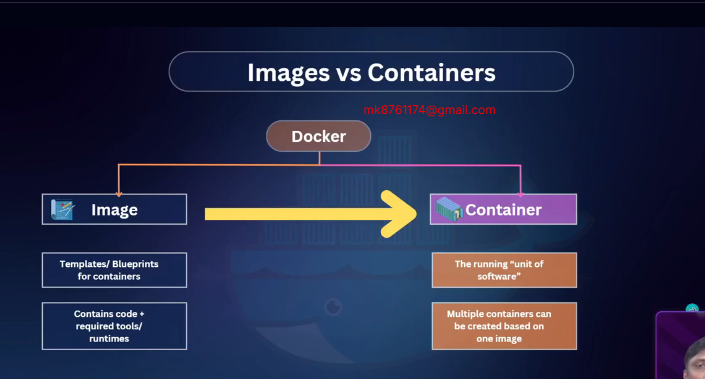
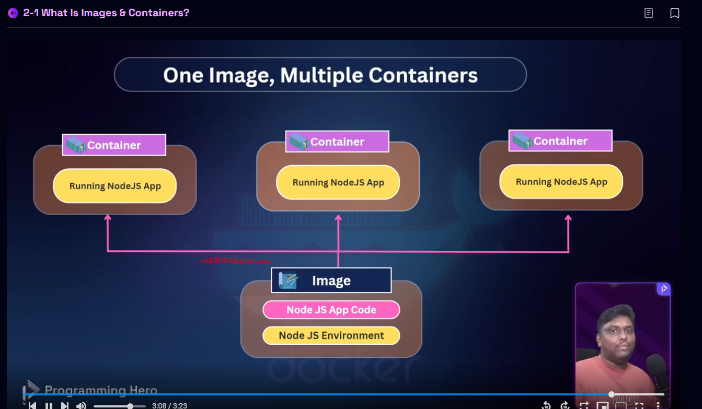
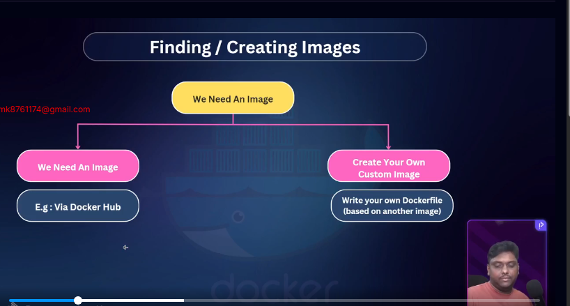
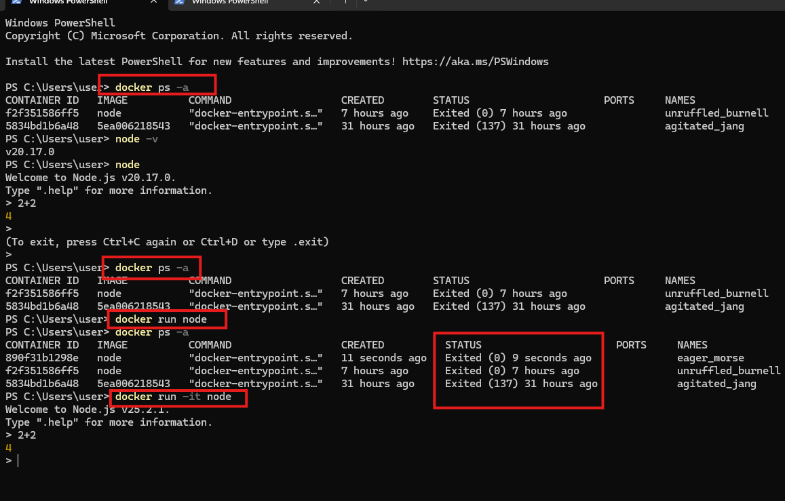
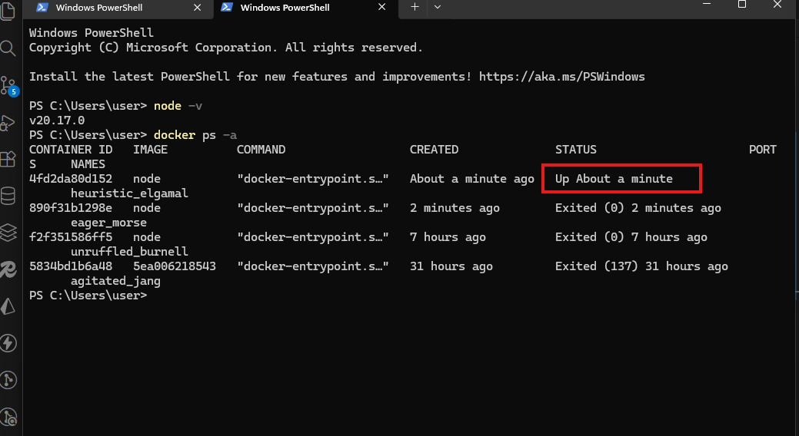

# Docker images and Containers 

Docker Cheat Sheet:
https://find-saminravi99.notion.site/Docker-Cheat-Sheet-10dc48b8ac8c80b79f73ece2abfc6841?pvs=4


GitHub Link:
https://github.com/Apollo-Level2-Web-Dev/docker-with-typescript-backend/tree/module-2

## 2-1 What is Images & Containers?
- docker give us container and container is unit of software and we need a image for run a container 
- image is a blue print of container

- container any developer if i can share and he is run and output what i can see same to same he can see output 
- and image is not editable (just see as like snapshot ) but container is editable 
- same image we can run many container


## 2-2 Using Pre-built Images
- pre build image any developer make this and share in the docker hub
- crate your own custom image


- now we testing pre build image 
now we run node  image this image build it node developer  https://hub.docker.com/_/node



```bash
# 1 now we run pre build image go to docker hub
docker run node 
# if not installed first its installed then run 
# 2 docker process (run machine) all 
 docker ps -a
# 3 show how many container now running and exited because this is a command run not machine running thats why show exited
# 4 if we are  running docker by command interaction  check status up about  (minute)
docker run -it node 
# show update version of node if you not install update version if we closed it then show status  exited  

```
