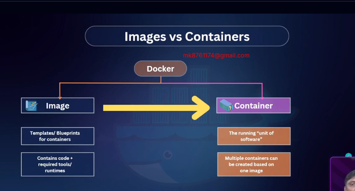
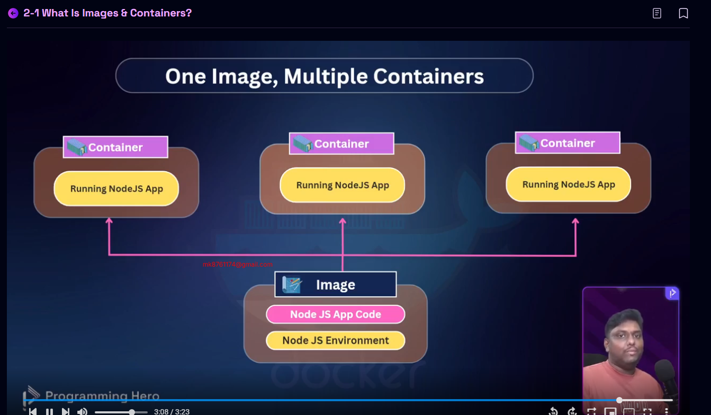
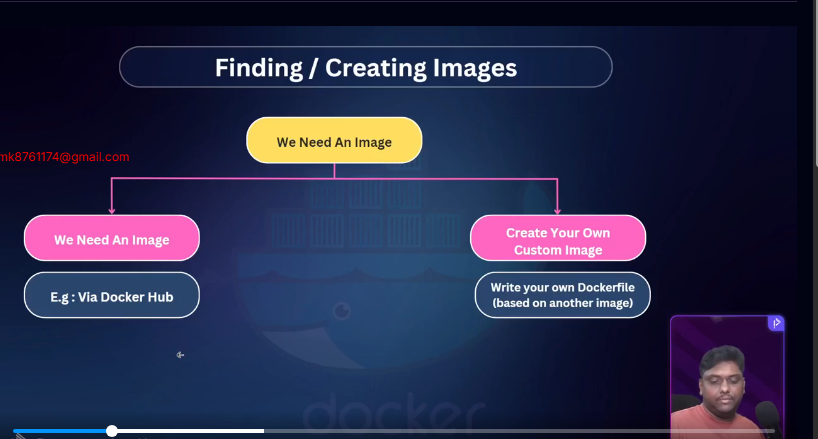
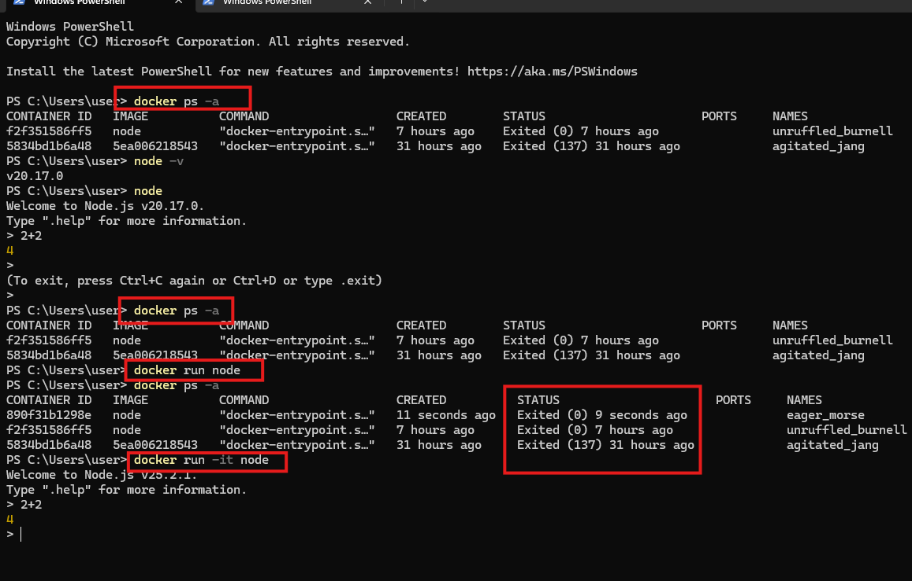
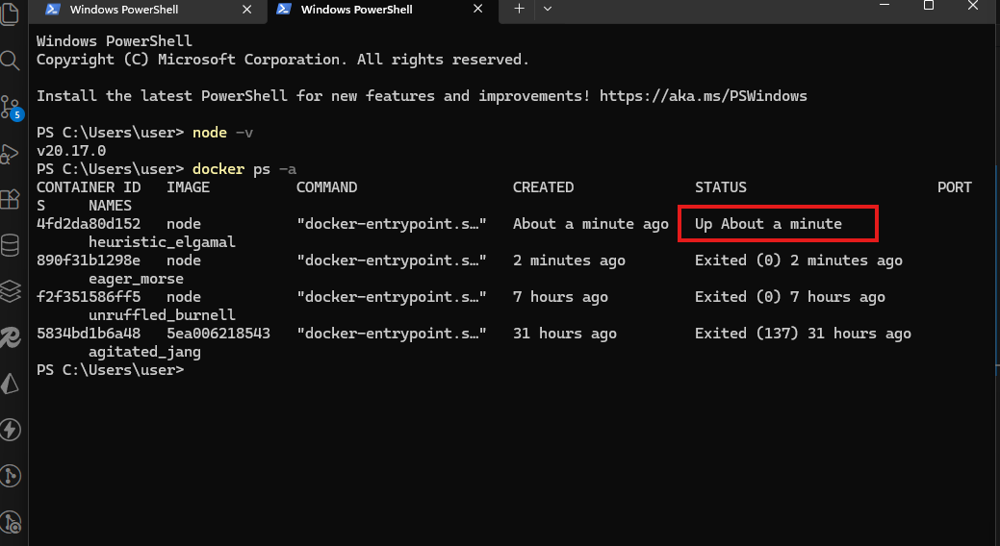

# Docker images and Containers 

Docker Cheat Sheet:
https://find-saminravi99.notion.site/Docker-Cheat-Sheet-10dc48b8ac8c80b79f73ece2abfc6841?pvs=4


GitHub Link:
https://github.com/Apollo-Level2-Web-Dev/docker-with-typescript-backend/tree/module-2

## 2-1 What is Images & Containers?
- docker give us container and container is unit of software and we need a image for run a container 
- image is a blue print of container

- container any developer if i can share and he is run and output what i can see same to same he can see output 
- and image is not editable (just see as like snapshot ) but container is editable 
- same image we can run many container


## 2-2 Using Pre-built Images
- pre build image any developer make this and share in the docker hub
- crate your own custom image


- now we testing pre build image 
now we run node  image this image build it node developer  https://hub.docker.com/_/node



```bash
# 1 now we run pre build image go to docker hub
docker run node 
# if not installed first its installed then run 
# 2 docker process (run machine) all 
 docker ps -a
# 3 show how many container now running and exited because this is a command run not machine running thats why show exited
# 4 if we are  running docker by command interaction  check status up about  (minute)
docker run -it node 
# show update version of node if you not install update version if we closed it then show status  exited  

```
##  2-3 Writing Our First Dockerfile
Key Points to Remember

Dockerfile instructions are executed top to bottom

RUN → runs at build time

CMD → runs at container start time

Keep Dockerfiles small and optimized

If you want, I can also explain:

Dockerfile for React

Dockerfile for Next.js

Multi-stage builds

Common Dockerfile interview questions


Building a Docker Image & Running a Container (Detailed Explanation)
## Docker works in two major phases:

1️ Build an Image (from a Dockerfile)
2️ Run a Container (from that image)

Understanding this clearly is very important for backend, DevOps, and interview preparation.

1️ What is a Docker Image?

A Docker Image is a read-only template that contains everything your application needs to run:

Base OS (Alpine, Ubuntu, etc.)

Runtime (Node.js, Python, Java, etc.)

Application source code

Dependencies (npm packages, libraries)

Environment configuration

Startup command

 Images are immutable — once built, they never change.

2️ What is a Docker Container?

A Container is a running instance of an image.

You can run multiple containers from the same image

Containers are lightweight and isolated

Containers can be started, stopped, restarted, or deleted

 Image →  Container

 Building an Image & Running a Container (Docker Explained)

This phrase describes the basic Docker workflow:
first you build an image, then you run a container from that image.

- 1 What is a Docker Image?

A Docker image is a read-only template that contains:

Application code

Runtime (Node, Python, etc.)

Libraries & dependencies

Configuration

 An image does not run by itself.
It is used to create containers.

- 2️ What is a Docker Container?

A Docker container is a running instance of an image.

Simple analogy:

Image = Blueprint / Recipe

Container = Running app / Cooked food

You can run multiple containers from the same image.

Naming & Tagging Containers and Images (Docker) — Explained Simply

When working with Docker, naming and tagging help you identify, manage, and version your containers and images easily.

1️⃣ Naming Containers
What is container naming?

A container name is a human-readable label for a running (or stopped) container.
If you don’t give a name, Docker automatically assigns a random one.

Why is it important?

Easy to remember

Easier to stop, start, or inspect containers

Avoids using long container IDs

Example
docker run --name my-app-container nginx


Now you can use:

docker stop my-app-container
docker start my-app-container
docker logs my-app-container


📌 Rule:

Container names must be unique

One name = one container

2️⃣ Naming Images
What is an image name?

An image name identifies a Docker image.
It usually follows this format:

repository-name:tag

Example
node
node:18
nginx:latest


node → repository name

18 → tag (version)

If no tag is provided, Docker uses:

:latest

3️⃣ Tagging Images
What is tagging?

A tag is used to define a version or variant of an image.

Tags help you:

Manage versions

Roll back safely

Avoid breaking changes

Example
docker pull node:18
docker pull node:20


Both are same image type, but different versions.


1. Create a Docker Hub Account

Go to Docker Hub and sign up.

Your username will be used in the image name.

Docker Hub image format:

<dockerhub-username>/<image-name>:<tag>


Example:

munna/myapp:1.0

2. Login to Docker Hub from Terminal
docker login


Enter:

Docker Hub username

Password (or access token)

Verify login:

docker info | findstr Username

3. Build Your Docker Image

From the folder containing Dockerfile:

docker build -t myapp .


Check image:

docker images

4. Tag the Image Correctly

Docker Hub requires tagging with your username.

docker tag myapp munna/myapp:1.0


Check again:

docker images


You should now see:

munna/myapp   1.0

5. Push Image to Docker Hub
docker push munna/myapp:1.0


If successful, you’ll see layer upload logs.

6. Verify on Docker Hub

Open Docker Hub

Go to Repositories

Your image will be there 🎉

7. Pull & Run from Anywhere

On any machine:

docker pull munna/myapp:1.0
docker run -p 3000:3000 munna/myapp:1.0

Common Mistakes (Very Important)

❌ Forgot to tag with username
❌ Not logged in
❌ Repo name mismatch
❌ Trying to push private repo on free plan

Best Practices

Use version tags:

myapp:1.0
myapp:1.1
myapp:latest


Keep images small (use node:alpine)

Add .dockerignore

One-Line Summary (Interview-Ready)

Build → Tag → Login → Push

If you want, I can:

Push a Node / React / MERN app

Explain private vs public repos

Show CI/CD auto push using GitHub Actions

## Deep Dive into Containers (Software Containers)
1. What is a Container?

A container is a lightweight, portable unit that packages:

Application code

Runtime (Node, Python, Java, etc.)

System libraries

Dependencies

Configuration

So the app runs the same way everywhere: laptop, server, cloud.

Famous line: “It works on my machine” problem — solved.

| Feature      | Container              | Virtual Machine   |
| ------------ | ---------------------- | ----------------- |
| OS           | Shares host OS kernel  | Has full guest OS |
| Size         | MBs                    | GBs               |
| Startup Time | Seconds / milliseconds | Minutes           |
| Performance  | Near native            | Heavier           |
| Isolation    | Process-level          | Full OS-level     |


🔍 Key insight:
Containers are NOT mini VMs. They are isolated processes running on the same kernel.

3. Core Technologies Behind Containers (How it really works)
a) Linux Namespaces

Namespaces isolate resources:

PID → process isolation

NET → network isolation

MNT → filesystem isolation

UTS → hostname isolation

IPC → inter-process communication

➡️ Each container thinks it’s alone.

b) Control Groups (cgroups)

Controls resource usage:

CPU limits

Memory limits

Disk I/O

Network bandwidth

Example:

This container can use max 512MB RAM


➡️ Prevents one container from killing the whole system.

c) Union File System (OverlayFS)

Containers use layered filesystems:

Base image layer (Ubuntu, Node, etc.)

App dependencies layer

App code layer

Result:

Faster builds

Less disk usage

Easy image sharing

4. Docker: The Most Popular Container Platform

Docker is a tooling ecosystem, not the container itself.

Docker Components:

Docker Engine → runs containers

Docker Image → blueprint (read-only)

Docker Container → running instance of image

Dockerfile → instructions to build image

5. Docker Image (Deep Explanation)

An image is:

Immutable (read-only)

Built in layers

Versioned (tags like node:18-alpine)

Example layers:

Ubuntu base
→ Node installed
→ npm packages
→ app code


If you change only app code → only top layer rebuilds.

6. Docker Container (Deep Explanation)

A container is:

A running process

Created from an image

Has its own:

filesystem

network

process space

Example:

docker run node-app


➡️ This creates:

writable layer on top of image

isolated runtime environment

7. Dockerfile (Important for Interviews)

Example:

FROM node:18-alpine
WORKDIR /app
COPY package.json .
RUN npm install
COPY . .
CMD ["node", "index.js"]

What happens?

Base image pulled

Working directory set

Dependencies installed

App copied

App starts

🔎 Each line = one image layer.

8. Container Networking (Simplified)

Docker provides:

Bridge network (default)

Host network

Overlay network (Swarm / Kubernetes)

Example:

Container A → talks to Container B via service name


➡️ No need for hardcoded IPs.

9. Data Persistence: Volumes vs Bind Mounts
Problem:

Containers are ephemeral (data lost when removed).

Solution:
a) Volumes (Recommended)
docker volume create mydata


Managed by Docker

Safe & portable

b) Bind Mounts
-v /local/path:/container/path


Direct host access

Used mostly in development

10. Container Lifecycle
Created → Running → Paused → Stopped → Removed


Commands:

docker ps
docker stop
docker start
docker rm

11. Security in Containers (Important Reality Check)

❌ Containers are NOT 100% secure by default.

Risks:

Shared kernel

Privileged containers

Root inside container

Best practices:

Use non-root user

Minimal base images (alpine)

Scan images for vulnerabilities

Limit capabilities

12. Containers in Production

Usually combined with:

Docker Compose → multi-container apps

Kubernetes → orchestration, scaling, self-healing

Example:

1 container crashes → Kubernetes restarts it automatically

13. Real-World Use Case (MERN App)

Frontend:

React container

Backend:

Node/Express container

Database:

MongoDB container

All connected via:

docker-compose.yml


Result:

One command → full app running

Same setup for dev, staging, prod

14. Why Containers Matter (Final Truth)

Containers give:

Consistency

Portability

Faster deployment

Easier scaling

DevOps automation

They are the foundation of modern cloud & microservices.


## Dockerfile 
FROM node:20

This sets the base image for the container.

It uses an official Node.js image with Node version 20

Node.js and npm are already installed

Ensures the app runs in a consistent environment everywhere

WORKDIR /app

This sets the working directory inside the container.

All commands after this will run inside /app

If /app does not exist, Docker creates it automatically

COPY package.json .

This copies only the package.json file into the container.

Why not copy everything yet?

This helps with Docker layer caching

If dependencies don’t change, Docker won’t reinstall them every time

Makes builds faster

RUN npm install

This installs all dependencies listed in package.json.

Runs during the image build process

Creates the node_modules folder inside the container

COPY . .

This copies all project files into the container’s working directory.

Source code

Config files

Routes, controllers, etc.

EXPOSE 5000

This documents that the container will listen on port 5000.

It does not open the port by itself

Used for clarity and by Docker tools

CMD ["npm", "run", "dev"]

This defines the default command that runs when the container starts.

Runs npm run dev

Usually starts the development server (e.g., using nodemon)

Summary

This Dockerfile:

Uses Node.js 20

Sets /app as the working directory

Installs dependencies

Copies the application code

Exposes port 5000

Starts the app using npm run dev

If you want, I can also explain:

Production-ready Dockerfile

Difference between CMD and RUN

Why dev is not recommended for production

How to run this container using docker run or docker-compose
##  Deep Dive Into Docker Images
1️⃣ What a Docker Image actually is (not the marketing version)

A Docker Image is not:

a VM

a running thing

a full OS

A Docker Image is:

an immutable, layered filesystem snapshot + metadata

Think of it as:

Base filesystem
+ changes layer 1
+ changes layer 2
+ changes layer 3
------------------
= Docker Image


It’s read-only by design.

2️⃣ Image vs Container (internals, not definition)
Image	Container
Blueprint	Running instance
Read-only layers	Writable layer added
Can be shared	Lives on a host
No process	Has PID 1

When you run an image:

docker run node:20


Docker does:

Takes image layers (read-only)

Adds one writable layer on top

Starts a process inside it

That writable layer dies when container dies.

3️⃣ Image Layers — the MOST important concept

Every line in a Dockerfile creates a layer.

Example:

FROM node:20
WORKDIR /app
COPY package.json .
RUN npm install
COPY . .


Layers:

node:20 base image

set working directory

copy package.json

install dependencies

copy source code

Each layer:

is cached

is immutable

only stores the difference from previous layer

This is why Docker is fast.

4️⃣ Layer caching (why Dockerfiles must be written carefully)

Docker builds images top → bottom.

If a layer changes:
👉 all layers after it are rebuilt

Bad Dockerfile:

COPY . .
RUN npm install


Any code change = npm install reruns ❌

Good Dockerfile:

COPY package.json .
RUN npm install
COPY . .


Dependencies cached ✔
Huge speed difference.

5️⃣ Union File System (OverlayFS)

Docker doesn’t merge files physically.

It uses Union FS:

overlayfs (Linux)

aufs (older)

Visual:

Layer 1 (base)
Layer 2 (deps)
Layer 3 (app)
----------------
Merged View (container sees this)


Container thinks it’s one filesystem.
Reality: many stacked layers.

6️⃣ Why Images are Immutable (critical design choice)

You cannot change an image.

If you do:

apt install curl


Inside container:

curl exists only in writable layer

image remains unchanged

To persist:
👉 you must build a new image

This gives:

reproducibility

rollback safety

identical environments

7️⃣ What is inside an Image (metadata level)

An image includes:

filesystem layers

environment variables

default command

entrypoint

exposed ports

working directory

user

You can inspect:

docker image inspect node:20


Important fields:

Cmd

Entrypoint

Env

RootFS.Layers

8️⃣ CMD vs ENTRYPOINT (deep clarity)
ENTRYPOINT

fixed executable

CMD

default arguments

Example:

ENTRYPOINT ["node"]
CMD ["server.js"]


Running:

docker run app
→ node server.js

docker run app index.js
→ node index.js


If you use only CMD:
👉 users can override everything

9️⃣ Base Images (this choice matters A LOT)

Common base images:

Image	Use case
ubuntu	debugging, tools
node	dev-friendly
node:alpine	production
scratch	ultra-minimal
distroless	secure prod
Why alpine?

~5MB

fewer vulnerabilities

faster pulls

But:

musl libc (some native libs break)

harder debugging

🔟 Multi-stage Builds (professional-level Docker)

This is huge.

# Build stage
FROM node:20 AS builder
WORKDIR /app
COPY . .
RUN npm install && npm run build

# Runtime stage
FROM node:20-alpine
WORKDIR /app
COPY --from=builder /app/dist ./dist
CMD ["node", "dist/main.js"]


Result:

build tools ❌

node_modules dev deps ❌

smaller image

safer

1️⃣1️⃣ Image Size = Performance + Security

Large image problems:

slow CI/CD

slow deploy

more CVEs

higher attack surface

Rules:

minimal base image

multi-stage builds

clean cache

RUN npm install && npm cache clean --force

1️⃣2️⃣ Image Tags (don’t ignore this)

Bad:

FROM node:latest


Why?

breaking changes

non-reproducible builds

Good:

FROM node:20.11-alpine


Pin versions. Always.

1️⃣3️⃣ Docker Image Security (real talk)

Images can contain:

secrets

SSH keys

.env

API tokens

Once pushed:
❌ cannot be removed from history easily

Rules:

never COPY .env

use .dockerignore

secrets via env vars / vault

1️⃣4️⃣ Image Registry (how images are shared)

Docker Image = content-addressed

Stored as:

layers (by hash)

manifest (JSON)

config

Registries:

Docker Hub

GHCR

AWS ECR

GCR

Same layers across images are reused → bandwidth saving.

1️⃣5️⃣ Why Docker Images are NOT VMs
VM	Docker Image
Full OS	Shared host kernel
Heavy	Lightweight
Slow boot	Instant
Hypervisor	Kernel namespaces

Docker = process isolation, not hardware virtualization.

1️⃣6️⃣ Common Myths (busted)

❌ “Docker images contain OS kernel”
✔ No, kernel is host’s

❌ “Containers are less secure”
✔ Misconfigured containers are

❌ “Docker replaces Kubernetes”
✔ Docker builds images, K8s runs them

Mental Model (remember this)

Docker Image = Immutable, layered filesystem snapshot + instructions
Container = Image + writable layer + running process